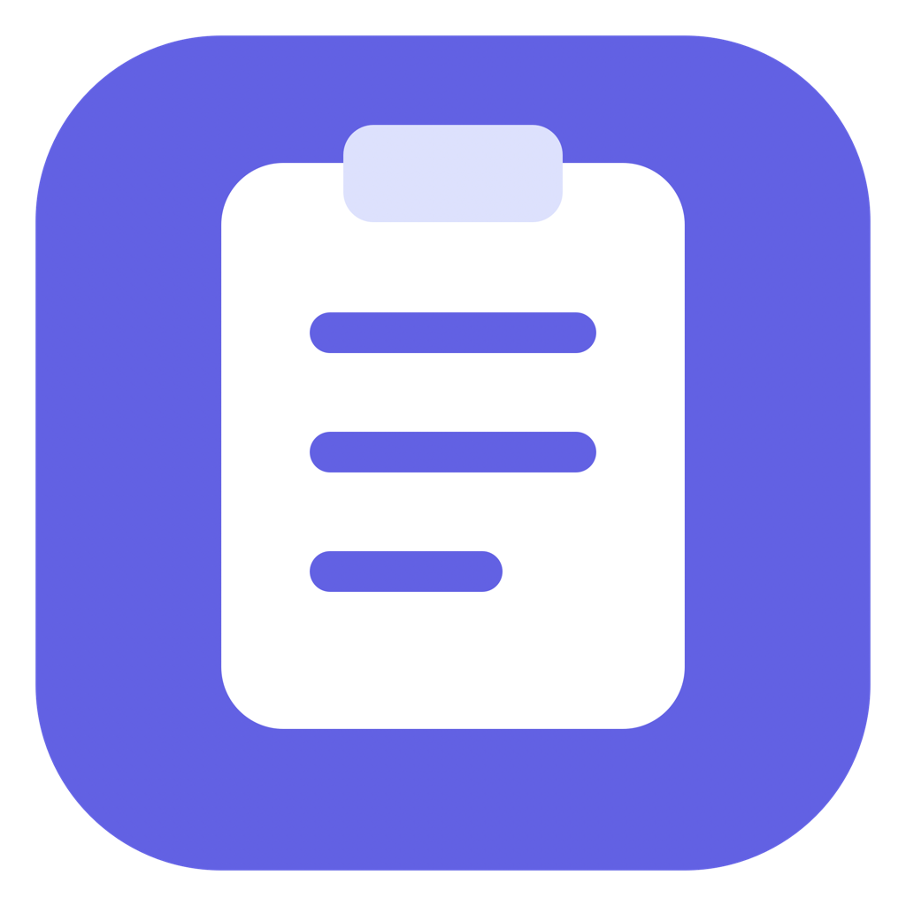
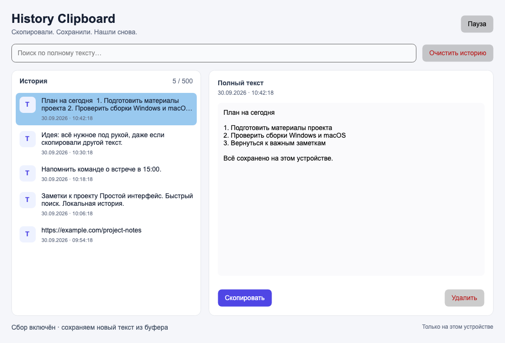

<p align="center">
  
</p>

<h1 align="center">History Clipboard</h1>
<p align="center"><b>Скопировали. Сохранили. Нашли снова.</b></p>
<p align="center">История текстового буфера обмена для Windows и macOS.<br>Русский интерфейс · Быстрый поиск · Данные на вашем устройстве</p>
<p align="center">
  <a href="https://github.com/Mizzzord/history-clipboard-srs/releases/tag/v1.0.0">Скачать 1.0.0</a> ·
  <a href="docs/USER_GUIDE.md">Руководство</a> ·
  <a href="docs/ACCEPTANCE.md">Проверки</a> ·
  <a href="Техническое-задание.md">Техническое задание</a>
</p>



*Изображение получено из интерфейса приложения с вымышленными записями.*

## Что умеет приложение

- Сохраняет скопированный текст в фоне, пока приложение открыто и сбор включён.
- Показывает новые записи сверху и сохраняет историю между запусками.
- Ищет по полному тексту без учёта регистра, включая кириллицу.
- Копирует полный текст выбранной записи, сохраняя пробелы и переводы строк.
- Позволяет поставить сбор на паузу, удалить запись или очистить историю с подтверждением.
- Хранит до **500 записей**, каждая — до **1 МиБ UTF-8**. При заполнении удаляет самую старую запись.

Последовательные одинаковые копирования объединяются: `А → А` даёт одну запись, `А → Б → А` — три. Копирование из самой истории новую запись не создаёт. Длинный текст просматривается по частям; кнопка копирует его целиком.

## Скачать и запустить

[Релиз 1.0.0](https://github.com/Mizzzord/history-clipboard-srs/releases/tag/v1.0.0) содержит самостоятельные сборки. Устанавливать .NET или Python для запуска не требуется.

| Платформа | Загрузка | Запуск |
| --- | --- | --- |
| Windows x64 | [ZIP с `.exe` и инструкцией](https://github.com/Mizzzord/history-clipboard-srs/releases/download/v1.0.0/HistoryClipboard-1.0.0-win-x64.zip) · [только `.exe`](https://github.com/Mizzzord/history-clipboard-srs/releases/download/v1.0.0/HistoryClipboard.exe) | Распакуйте ZIP, откройте `HistoryClipboard.exe` |
| Mac с Apple Silicon | [ZIP с `.app`](https://github.com/Mizzzord/history-clipboard-srs/releases/download/v1.0.0/HistoryClipboard-1.0.0-osx-arm64.zip) | Распакуйте, перенесите приложение в «Программы» |
| Mac с Intel | [ZIP с `.app`](https://github.com/Mizzzord/history-clipboard-srs/releases/download/v1.0.0/HistoryClipboard-1.0.0-osx-x64.zip) | Распакуйте, перенесите приложение в «Программы» |

Целевые системы: Windows 10/11 x64 и macOS 12+. Фактическое покрытие платформ указано в [отчёте о приёмке](docs/ACCEPTANCE.md). Интерактивный интерфейс Windows/Intel Mac и минимальные версии ОС требуют отдельного прогона.

Сборки не имеют коммерческих сертификатов Windows Authenticode / Apple Developer ID. Mac-приложения подписаны ad-hoc и не нотариализованы Apple; ОС может потребовать дополнительное подтверждение открытия. Порядок запуска описан в [руководстве](docs/USER_GUIDE.md). Контрольные суммы — в файле [SHA256SUMS.txt](https://github.com/Mizzzord/history-clipboard-srs/releases/download/v1.0.0/SHA256SUMS.txt).

Репозиторий закрытый: скачивание через GitHub требует входа в аккаунт с доступом к нему.

## Первые шаги

1. Откройте приложение и прочтите предупреждение о личных данных.
2. Нажмите **«Понятно, начать»** и скопируйте текст в другом приложении.
3. Найдите запись в истории или через поиск, выберите её и нажмите **«Скопировать»**.
4. Перед копированием чувствительных данных нажмите **«Пауза»**.

| Действие | Windows | macOS |
| --- | --- | --- |
| Перейти к поиску | `Ctrl+F` | `⌘F` |
| Скопировать выбранную запись | `Ctrl+Enter` | `⌘Enter` |
| Очистить запрос | `Esc` | `Esc` |
| Удалить запись при фокусе в списке | `Delete` | `Delete` |

Закрытие окна завершает приложение. Автозапуск и значок в трее не входят в эту версию. Текст, который уже находился в буфере при запуске или возобновлении сбора, не добавляется задним числом. Изображения и файлы не сохраняются.

## Где хранятся данные

История находится в локальной SQLite-базе `history.db`:

- Windows: `%LOCALAPPDATA%\HistoryClipboard\`
- macOS: `~/Library/Application Support/HistoryClipboard/`

Приложение не отправляет содержимое буфера по сети и не записывает полный текст в журналы. История **не зашифрована** и может содержать пароли или другие личные данные. При повреждении базы приложение останавливает сбор и предлагает явное восстановление с резервной копией исходных файлов.

## Разработка

Стек: **C# · .NET 8 · Avalonia 11.3.22 · Microsoft.Data.Sqlite 8.0.31**. SDK 8.0.425 закреплён в `global.json`, версии зависимостей — в `packages.lock.json`.

```sh
dotnet restore --locked-mode
dotnet run --project src/HistoryClipboard.Desktop
dotnet test -c Release --no-restore
```

Полная упаковка трёх платформ выполняется на Mac с Command Line Tools:

```sh
python3 scripts/build.py
```

Только Windows, в том числе на Windows:

```sh
python scripts/build.py --rid win-x64
```

Скрипт выполняет тесты, создаёт самостоятельные сборки в `artifacts/`, подписывает `.app` локальной ad-hoc подписью и записывает SHA-256. Закройте приложения из `artifacts` перед пересборкой. Бинарные файлы публикуются в GitHub Releases; исходный Git остаётся без тяжёлых сборок.

При разработке можно отключить служебную телеметрию SDK и сборки Avalonia переменными `DOTNET_CLI_TELEMETRY_OPTOUT=1` и `AVALONIA_TELEMETRY_OPTOUT=1`; скрипт устанавливает их сам. Приложение не содержит runtime-телеметрии.

Автоматическая сборка: [GitHub Actions](https://github.com/Mizzzord/history-clipboard-srs/actions/workflows/build.yml). Проверка готового файла без интерфейса и изменения буфера:

```sh
HistoryClipboard --self-test --report report.json
# Windows: HistoryClipboard.exe --self-test --report report.json
```

Настоящий буфер Windows и macOS проверяется только на явно разрешённом одноразовом тестовом окружении: `HISTORY_CLIPBOARD_NATIVE_TESTS=1`. Не включайте эту проверку на рабочем компьютере: она заменяет буфер тестовыми значениями. GitHub Actions включает её на соответствующих Windows/Mac runner.

Для macOS: задайте `HISTORY_CLIPBOARD_DATA_DIR` на отдельную папку `artifacts/qa-*`, запустите QA-приложение и `python3 scripts/integration-macos.py --data-dir artifacts/qa-example`. После проверки приостановите или закройте QA-приложение и создайте `restore-clipboard.signal` в этой папке. Скрипт держит исходный текст буфера только в памяти до восстановления; пользовательская история в проверке не используется.

## Документы проекта

| Документ | Содержание |
| --- | --- |
| [Руководство пользователя](docs/USER_GUIDE.md) | Запуск, управление, личные данные и ошибки |
| [Отчёт о приёмке](docs/ACCEPTANCE.md) | Выполненные проверки и ограничения платформ |
| [План и решения](DEVELOPMENT.md) | Этапы разработки и принятые правила |
| [Техническое задание](Техническое-задание.md) | Исходные требования учебного кейса |
| [Черновики задач](issues) | Разбиение исходного задания на Issues |
| [Размещение требований](РАЗВЕРТЫВАНИЕ.md) | Исходная инструкция GitHub Wiki и Issues |
| [Лицензии зависимостей](THIRD_PARTY_NOTICES.md) | Уведомления библиотек, включённых в сборки |

Синхронизация, изображения, файлы и мобильные платформы находятся за границами MVP. Лицензия на собственный код проекта пока не назначена; лицензии сторонних компонентов сохранены отдельно.
